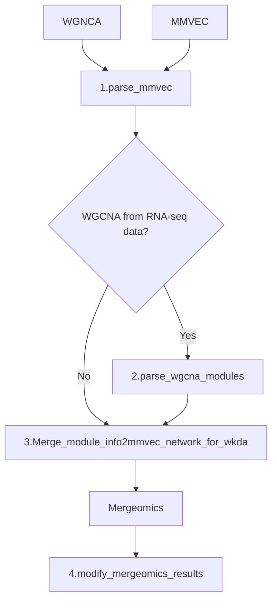

# Multiomics data analysis and code for ketogenic diet therapy for pediatric epilepsy 

This github page contains source code used for multiomics data analysis in  
"Ketogenic diet therapy for pediatric epilepsy 
is associated with alterations in the human gut microbiome 
that confer seizure resistance in mice"

Each directory contains donors & recipients data and relevant source codes in jupyter notebook format. Due to the size limit mmvec result files are stored in the [Google Drive](https://drive.google.com/drive/folders/1Z8sWRNHAHaUCh3hYm9MvkVGY32F4IZ1w?usp=sharing).

The overall schematic looks like below: 
After 3.Merge_module_info2mmvec_network_for_wkda, the output files were used in [Mergeomics](http://mergeomics.research.idre.ucla.edu/) webpage to perform wKDA analysis.
The results of wKDA were then used to modify the node description in 4.modify_mergeomics_results. 
After 4.modify_mergeomics_results, the results files were loaded onto the Cytoscape for further visualization.

